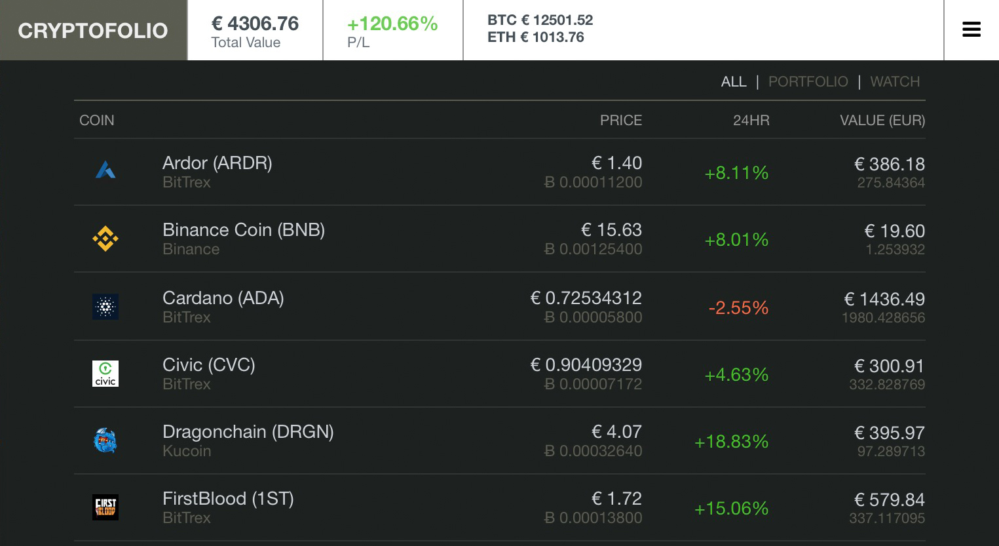

# Simple cryptocurrency portfolio in PHP
Your personal cryptocurrency portfolio
Get an overview of all your assets and balances

### Requirements
- Webserver that can serve PHP

### Features
- API integration with Kraken, Bittrex, Binance, Kucoin and Poloniex
- Retrieves your balances and calculates your total portfolio value
- Add coins manually (that are living in a wallet) or to add them to the watchlist
- Prices are market average and are calculated in EUR
- Charts (techanjs)
- Works on mobile and webapp capable on iOS

### Install
- Clone or copy the the structure into a webfolder
- Make lib/data writable
- Move config.json outside the web directory for security (as your API keys will be stored in here)
- Make sure config.json is writable with the correct owner:group and make sure the directory and file can be accessed by your webserver
- Edit config.php and modify the path where `config.json` is located. 

#### Example ####
*linux*

```$configfile = '/home/mydir/config.json';```

*windows* (use forward slashes ufn)

```$configfile = 'c:/mydir/config.json';```

- Open your browser and navigate to the url: to the m00n!
- Click the hamburger icon in the right top to:
  - Add coins
  - Your initial investment
  - Set a username/password if desired.
  - Add API keys (use read-only keys for security).


Uses d3.js, techanjs for the charts and cryptocompare.com for the API.




