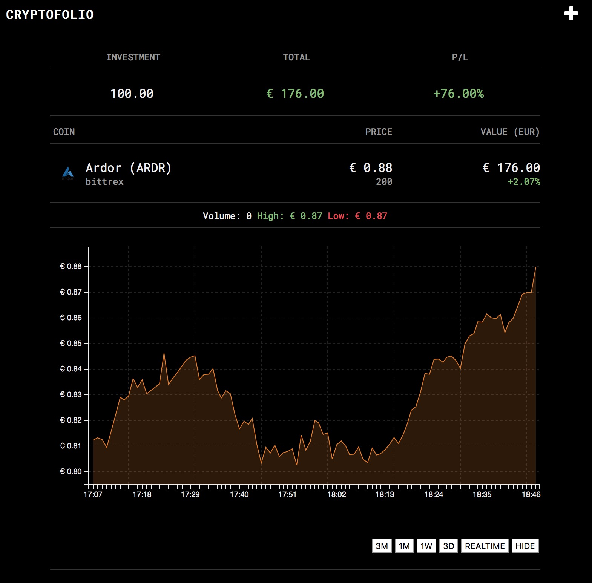
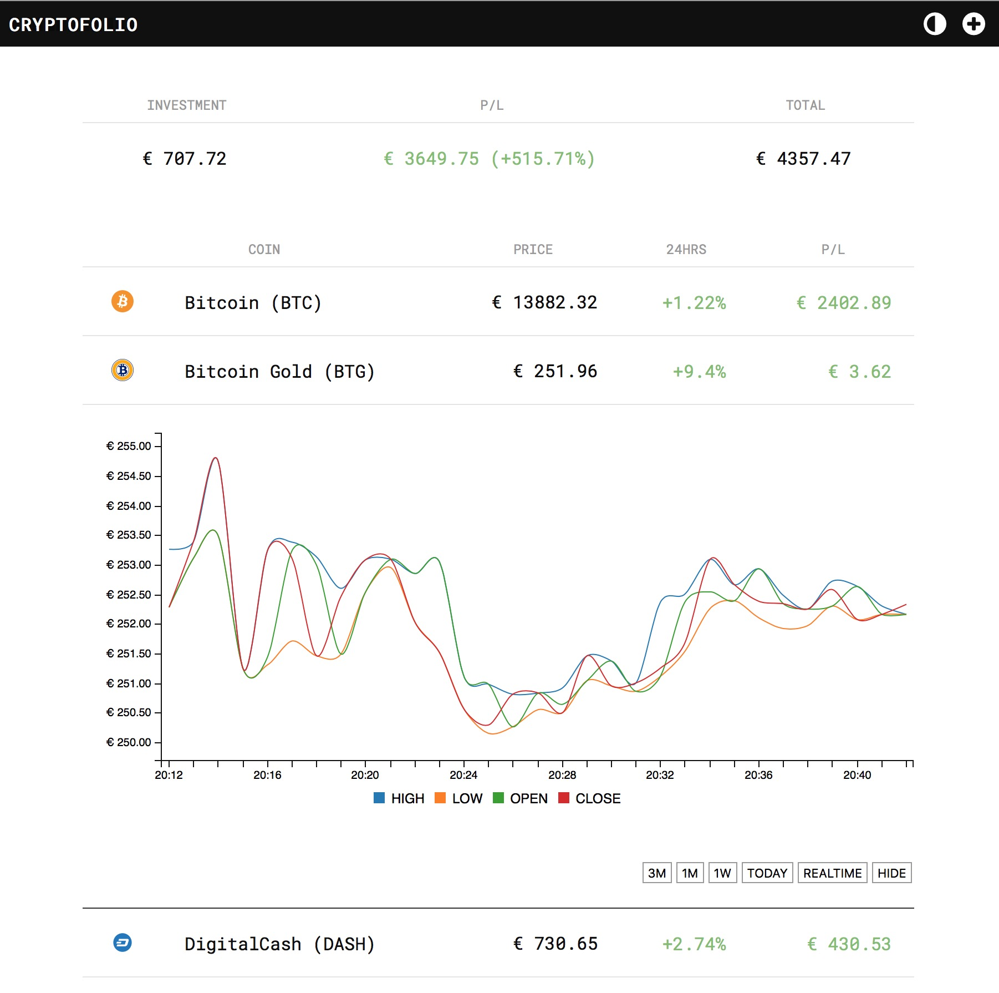

# Simple cryptocurrency portfolio in PHP

### Requirements
- Webserver that can serve php
- lib/data needs to be writable by the webserver to cache images and to write portfolio.json

### Features
- Create your personal cryptocurrency portfolio
- Add coins and specify the coin you bougth them with at a certain date, it will calculate the price in euros (for now) for that date.
- Light/Dark theme
- Works on mobile 

Uses d3.js, c3.js and cryptocompare.com for the API.

